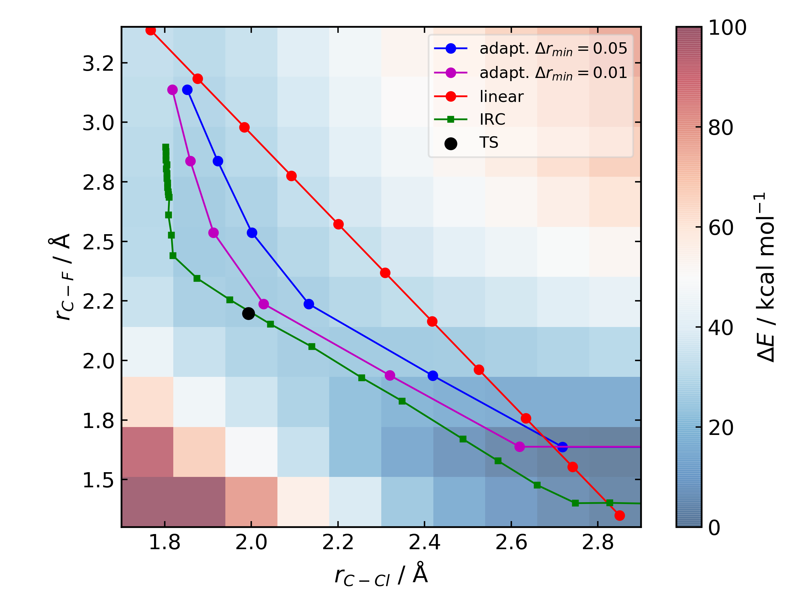
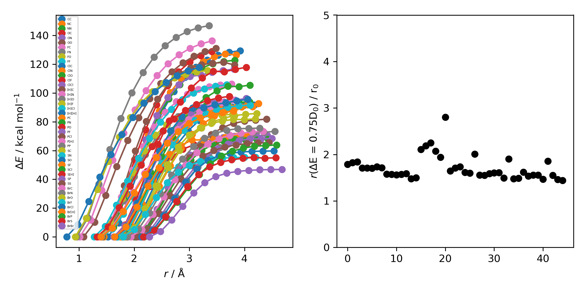

Changelog
=========

1.0.0b3
--------
------------

This version brings several major changes and in some instances breaks
backwards compatibility, but does feature significant improvements in speed
and accuracy for finding transition states.

Usability improvements
**********************

- :code:`species.get_distance(i, j)` is now :code:`species.distance(i, j)`

- :code:`species.set_atoms(new_atoms)`  is now properly handled with a setter so :code:`species.atoms = new_atoms` will set the new atoms

- :code:`species.n_atoms` is more robust

- :code:`species.get_coordinates()` is now :code:`species.coordinates`, returning a numpy array copy of the species coordinates (Nx3 in Å)

- :code:`species.centre()` will translate a species so it's coordinate centroid lies at the origin

- PBE0/def2-SVP is now the default 'low opt' method (`keywords.low_opt`) with loose optimisation. Path exploration uses this method, thus it needs to be very close to the 'opt' level

Functionality improvements
**************************

- 1D, 2D potential energy surface scans and nudged elastic band (NEB) methods to generate TS guesses from reactants have been replaced by an adaptive path search which seems to be very efficient for generating initial paths
For the prototypical SN2 between fluoride and methyl chloride the relaxed PES (PBE0-D3BJ/ma-def2-SVP/CPCM(water)) is

where the previously employed linear path (red) is compared to the adaptive scheme (blue, purple) and the 'true' intrinsic reaction coordinate.
With a small minimum step size a path very close to the MEP is traversed with a very small number of required constrained optimisations. This
enables NEB relaxations to be skipped and the associated limitations (corner cutting, oscillating path, optimisation in Cartesian coordinates)
avoided. This exploration is essential when a linear path over multiple bonds leads to rearrangements, e.g. an (E2) elimination reaction the
comparison for the linear, adaptive and IRC paths are shown below

- (CI)-NEB with adaptive force constant has been added

- Initial path exploration from reactants is performed at the 'low_opt' level with a final breaking bond distance below.

Previous implementations made use of a 1.5 Å additional shift for uncharged reactions
and 2.5 Å for charged, this however lead to possible final C-H distances of ~3.6 Å and steps
into unphysical regions. 1.0.0b3 uses an estimate based on the distance where the bond
is mostly broken, as below

where X-Y corresponds to a molecule e.g. C-C with the appropriate hydrogens added
then the BDE curve calculated at the GFN2-XTB level of theory. A multiplier of ~2 affords a
'mostly broken bond' (i.e. the distance at 3/4 of energy of the broken bond).

- There is now a heuristic used to skip TSs that go via small rings (3, 4-membered) if there is a >4-membered equivalent (:code:`ade.Config.skip_small_ring_tss`)

Bug Fixes
*********

- Calculations are now unique based on constraints, so NEB calculations executed in the same directory are not skipped with different bond rearrangements
