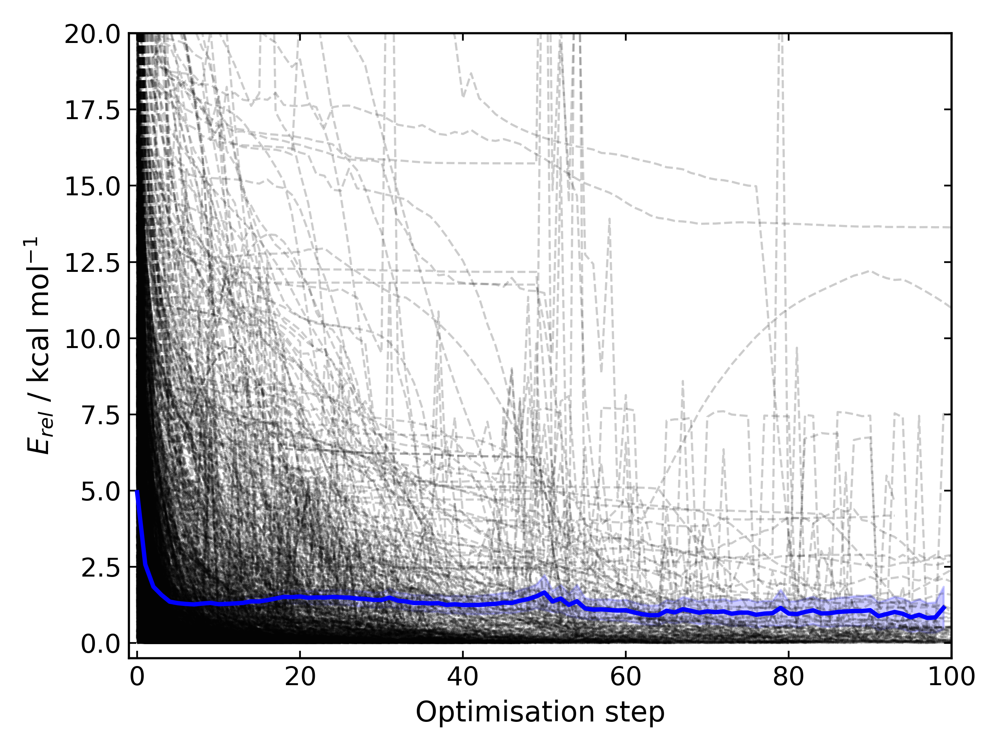

Changelog
=========

1.1.0
--------
----------

API improvements that broadly maintain backwards compatibility.

Usability improvements/Changes
******************************
- Adds more argument and return types
- Changes :code:`AtomCollection.atoms` to a property for more flexible sub-classing
- Changes :code:`ElectronicStructureMethod.doi_str` and :code:`Keyword.doi_str` to properties
- Adds interpretable :code:`repr(Species)`
- :code:`Species.energies` is zeroed when the :code:`Species.atoms` are reset or change
- :code:`Species.energy` is a property of the last computed energy on that species
- :code:`Species.is_linear` now uses an angle tolerance to determine linearity, which is slightly tighter than the previous float-based tolerance
- Removes :code:`CalculationOutput.set_lines` in favour of a cached file_lines property to avoid :code:`set_file_lines()`
- Removes :code:`CalculationOutput.get_free_energy()` in favour of :code:`Species.free_energy` once a Hessian is set for a molecule and similarly with :code:`CalculationOutput.get_enthalpy()`
- Removes :code:`CalculationOutput.get_imaginary_freqs()` (now :code:`Species.imaginary_frequencies`) and :code:`CalculationOutput.get_normal_mode_displacements()` (now :code:`Species.normal_mode()`)
- :code:`Species.imaginary_frequencies` now returns :code:`None` rather than an empty list for a species without any imaginary frequencies, to be consistent with other properties
- Changes :code:`CalculationOutput.terminated_normally()` to a property (:code:`CalculationOutput.terminated_normally`)
- Removes :code:`Reaction.find_complexes` in favour of setting the reactant and product complexes dynamically, unless :code:`Reaction.calculate_complexes` is called to find association complexes
- Tweaks the default relative tolerance on bonds to account for M-X agostic interactions lengthening bonds
- Enables :code:`Species.atoms` to be added, even if they are `None`
- Improved atom setting of :code:`Complex.atoms`
- Changes :code:`Complex.get_atom_indexes()` to :code:`Complex.atom_indexes()`
- Changes :code:`Complex.molecules` to a private attribute as the atoms/energy/gradient is not propagated
- Allows for :code:`Species.translate()` and :code:`Species.rotate()` to be called using vectors as lists or tuples rather than just numpy arrays
- Modifies :code:`get_truncated_complex()` to :code:`get_truncated_species()` and changes the return type to a species to reflect a possibly different molecular composition of the complex
- Improves peak checking in adaptive path TS guess generation
- Removes :code:`autode.atoms.get_thing()` functions, in favour of :code:`Atom.thing`
- Raises an exception if a single point energy evaluation fails to execute successfully
- Removes :code:`autode.conformers.conformer.get_conformer()` in favour of a more flexible :code:`autode.conformer.Conformer` constructor
- Adds :code:`Species.constraints` that are used in optimisations (still available in :code:`Calculation` initialisation)

Functionality improvements
**************************

- Adds angle and dihedral angle properties to an :code:`AtomCollection`
- Improves and adds more :code:`Unit` definitions
- Adds :code:`Value` and :code:`ValueArray` base classes for energies, gradients etc. These allow for implicit (1 Hartree == 617.509 kcal mol-1) comparisons and explicit conversion (1 Hartree).to('kcal')
- Adds further conversion factors to :code:`Constants`
- Adds :code:`Species.energies` as a container of all energies that have been calculated at a geometry
- Adds :code:`Keywords.bstring` as a 'brief' summary of the keywords e.g. PBE0/def2-SVP and are associated with an :code:`Energy` (a type of :code:`Value`)
- Improves quick reaction coordinate characterisation of TSs by providing a maximum atomic displacement for improved initial structures
- Adds Hessian diagonalisation to obtain normal modes with and without translation and rotation projections for linear and non-linear molecules
- Adds :code:`Species.weight` and :code:`Species.mass` as equivalent properties for the molecular weight
- Improves dihedral sampling in molecule generation
- Adds :code:`atoms.remove_dummy()` to remove all dummy atoms from a set
- Enables different force constants to be used in XTB constrained optimisations (:code:`Config.XTB.force_constant`, which sets :code:`wrappers.XTB.XTB.force_constant`)
- Adds :code:`Solvent.copy()`
- Adds :code:`Species.reorder_atoms()` to reorder the atoms in a species using a mapping
- Adds :code:`Config.ORCA.other_input_block` to allow for a block of input to be printed in all ORCA input files
- Changes the loose optimisations to only use a maximum of 10 iterations. This is based on an analysis of 3500 ORCA
optimisations, which plateaus quickly:

suggesting a value of 10 is a appropriate. This will be system dependent and need increasing for
large/flexible systems. For path optimisations loose optimisations use a maximum of 50 cycles.

Bug Fixes
*********

- Skips conformers with no atoms in finding unique conformers
- Corrects benchmark TS location for the Grubbs metathesis example, where the reactant complex is bound
- Fixes possible zero distance constraint for a single atom
- Fixes spin state definition for XTB calculations
- Fixes possible override of a constructor-defined spin state by the SMILES parser

1.0.5
--------
----------

Bugfix release

Bug Fixes
*********
- Saves transition state templates with correct atom labels

1.0.4
--------
----------

Bug fixes in SMILES parser and 3D geometry builder from 1.0.3.

Usability improvements
**********************

- Improves doc strings
- Throws interpretable error when calling :code:`find_tss`  without :code:`reaction.reactant` set

Functionality improvements
**************************

- SMILES strings with >9 ring closures are parsed correctly
- cis-double bonds in rings no longer minimise with constraints, which is a little faster

Bug Fixes
*********
- Tweaks repulsion parameters in minimisation to build fused rings
- Enables SMILES parsing with "X(...)1" branching
- Fixes spin multiplicity for odd numbers of hydrogens
- Improves ring closure 3D build
- Fixes incorrect implicit valency for aromatic heteroatoms
- Improves metal finding in SMILES strings with regex
- Corrects atom type for sp2 group 16 elements
- Fixes dihedral rotation with atoms not close to any other

1.0.3
--------
----------

A minor API revision from 1.0.2 but adds C++ extension which should be extensible to
further developments of fast C-based code.

Usability improvements
**********************

- :code:`autode.Species()` inherit from a :code:`AtomCollection()` base class for more flexibility

- :code:`autode.Constants` attributes have more readable names (while retaining backwards compatability)

- :code:`autode.geom.length()` as an explicit alias of :code:`np.linalg.norm` has been removed

- :code:`autode.input_output.xyz_file_to_atoms()` throws more informative errors

- :code:`autode.mol_graphs.make_graph()` throws NoAtomsInMolecule for a species with no atoms

- :code:`species.formula` and :code:`species.is_explicitly_solvated` are now a properties

- :code:`autode.smiles.parser` has been rewritten & is (hopefully) a more robust SMILES parser

Functionality improvements
**************************

- Metal complex initial geometries can now be generated with the correct stereochemistry

- Macrocycles default to an **autodE** builder that conserves SMILES stereochemistry (`RDKit#1852 <https://github.com/rdkit/rdkit/issues/1852>`_)

- :code:`species.coordinates` can be set from either 3xN matrices or 3N length vectors

- :code:`autode.Atom()`s have :code:`.group` :code:`.period` and :code:`.tm_row` properties referring to their location in the periodic table

- :code:`autode.atoms.PeriodicTable` added

- :code:`species.bond_matrix` added as a property and returns a boolean array for interactions between all atom pairs

Bug Fixes
*********

- :code:`reaction.calculate_complexes()` calls :code:`reaction.find_complexes()` if needed thus can be called in isolation

1.0.2
--------
----------

Usability improvements
**********************

- Effective core potentials can now be specified in :code:`Keywords()`

- ORCA fitting basis sets now default to def2/J, which should be smaller but as accurate as AutoAux

- Molecule initialisation from a .xyz file now checks for an odd number of electrons. For example, :code:`Molecule('H_atom.xyz')` will raise a :code:`ValueError` but :code:`Molecule('H_atom.xyz', charge=1)` or :code:`Molecule('H_atom.xyz', mult=2)` are acceptable

Functionality improvements
**************************

- :code:`atom.atomic_number` has been added as an atom attribute

- :code:`atom.atomic_symbol` is a more intuitive alias for :code:`atom.label`

1.0.1
--------
------------

Usability improvements
**********************

- Molecular complexes can now be initialised with a reasonable geometry :code:`Complex(..., do_init_translation=True)`

Functionality improvements
**************************

- :code:`species.radius` has been added as an approximate molecular radius (in Angstroms, excluding VdW radii)

Bug Fixes
*********

- Final breaking bond distances are now the minimum of the product X-Y distance if present in the product, or 2x the distance. This is required for breaking bonds that cross a ring.

- Neighbour lists for comparing possibly equivalent bond rearrangements are now compared using a sorted list

1.0.0
--------
------------

The first stable release! Mostly documentation updates from v.1.0.0b3 with the
package now being conda-install-able.

Usability improvements
**********************

- More documentation

Functionality improvements
**************************

- XTB wrapper now supports v. 6.4 (and hopefully higher)

Thanks to Joe, Alistair, Matina, Kjell, Gabe, Cher-Tian amongst others for their invaluable contributions.

1.0.0b3
--------
------------

This version brings several major changes and in some instances breaks
backwards compatibility, but does feature significant improvements in speed
and accuracy for finding transition states.

Usability improvements
**********************

- :code:`species.get_distance(i, j)` is now :code:`species.distance(i, j)`

- :code:`species.set_atoms(new_atoms)`  is now properly handled with a setter so :code:`species.atoms = new_atoms` will set the new atoms

- :code:`species.n_atoms` is more robust

- :code:`species.get_coordinates()` is now :code:`species.coordinates`, returning a numpy array copy of the species coordinates (Nx3 in Å)

- :code:`species.centre()` will translate a species so it's coordinate centroid lies at the origin

- PBE0/def2-SVP is now the default 'low opt' method (`keywords.low_opt`) with loose optimisation. Path exploration uses this method, thus it needs to be very close to the 'opt' level

Functionality improvements
**************************

- 1D, 2D potential energy surface scans and nudged elastic band (NEB) methods to generate TS guesses from reactants have been replaced by an adaptive path search which seems to be very efficient for generating initial paths
For the prototypical SN2 between fluoride and methyl chloride the relaxed PES (PBE0-D3BJ/ma-def2-SVP/CPCM(water)) is

.. image:: common/adapt_surface_sn2.png
   :width: 500

where the previously employed linear path (red) is compared to the adaptive scheme (blue, purple) and the 'true' intrinsic reaction coordinate.
With a small minimum step size a path very close to the MEP is traversed with a very small number of required constrained optimisations. This
enables NEB relaxations to be skipped and the associated limitations (corner cutting, oscillating path, optimisation in Cartesian coordinates)
avoided. This exploration is essential when a linear path over multiple bonds leads to rearrangements, e.g. an (E2) elimination reaction the
comparison for the linear, adaptive and IRC paths are shown below

- (CI)-NEB with adaptive force constant has been added

- Initial path exploration from reactants is performed at the 'low_opt' level with a final breaking bond distance below.

Previous implementations made use of a 1.5 Å additional shift for uncharged reactions
and 2.5 Å for charged, this however lead to possible final C-H distances of ~3.6 Å and steps
into unphysical regions. 1.0.0b3 uses an estimate based on the distance where the bond
is mostly broken, as below

.. image:: common/XY_bde_XTB.png

where X-Y corresponds to a molecule e.g. C-C with the appropriate hydrogens added
then the BDE curve calculated at the GFN2-XTB level of theory. A multiplier of ~2 affords a
'mostly broken bond' (i.e. the distance at 3/4 of energy of the broken bond).

- There is now a heuristic used to skip TSs that go via small rings (3, 4-membered) if there is a >4-membered equivalent (:code:`ade.Config.skip_small_ring_tss`)

Bug Fixes
*********

- Calculations are now unique based on constraints, so NEB calculations executed in the same directory are not skipped with different bond rearrangements
