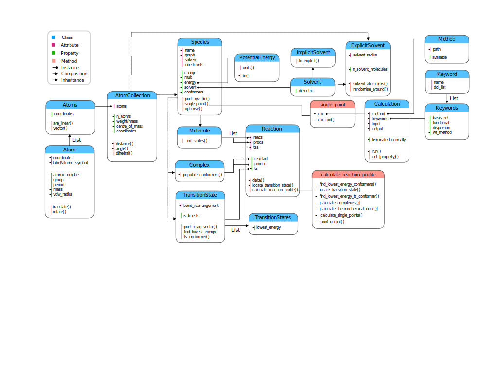

Development
===========

Contributions in any form are very much welcome - the following documentation
is aimed at outlining the general structure of the code to aid new developers.

Simplified UML
**************

The broad structure of the code is

Naming
******

Variables and functions should be 'snake_case' and classes 'CamelCase'.
:code:`get_thing` methods are discouraged and properties used in their place.

Versioning
**********

Versioning is semantic in the **X.Y.Z** style. X is unlikely to exceed 1 baring a
complete rewrite; Y should be updated whenever there are backwards incompatible
changes; Z should be incremented for bugfixes and tweaks that maintain all
components of the public facing API.
