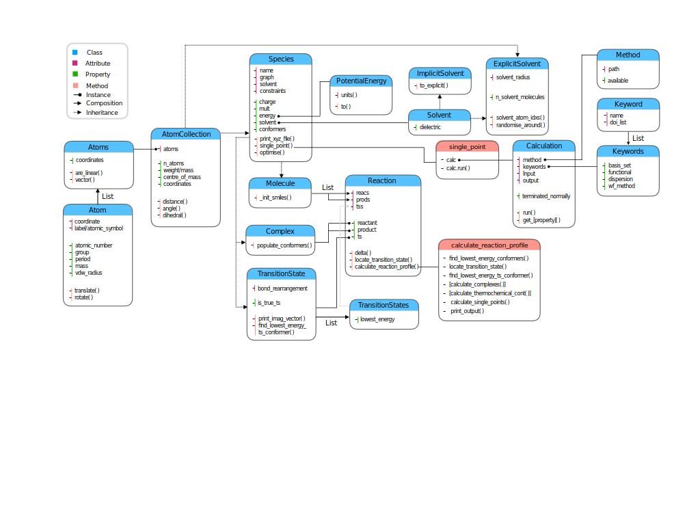

**************
Code Structure
**************

Overview
########

The **autodE** code base is structured around a :code:`Reaction` class, due to
the initial singular goal of calculating reaction profiles.

.. image:: ../common/reaction_simple_uml.svg
   :target: ../_images/reaction_simple_uml.svg
   :width: 550
   :align: center

|
|

The key attributes include :code:`reacs` and :code:`prods` as individual molecules
comprising the reactants and products of the reaction. Transition states connecting
reactants and products are held in :code:`tss`. From these attributes are generated
properties, including :code:`reactant` and :code:`product`, which are the associated
association complexes of all reactants and products. The :code:`ts` property is
simply the lowest energy transition state and :code:`None` if
:code:`len(reaction.tss) == 0`.

Overall class structure
#######################

Zooming out, the composition and inheritance between of some of the
classes arising from :code:`Reaction` (center) is shown below.

|

|

Species
*******

Individual atoms are collected into a :code:`Atoms` class which becomes an
(effective) attribute of an :code:`AtomCollection`, which serves as a base
class for all objects with associated :code:`atoms`. A :code:`Species` adds
a molecular graph, solvent and name attributes and is the parent class of
a :code:`Molecule`, :code:`Complex` and :code:`TransitionState`.

Values
******

Quantities with associated units e.g. an angle or energy are subclasses of
:code:`autode.values.Value`, which facilitate the conversion between units
(using :code:`value.to()`). For example, :code:`species.energy` returns a
:code:`PotentialEnergy` instance (if the energy has been calculated with e.g.
:code:`species.single_point()`).

Solvent
*******

Species in the gas phase have :code:`species.solvent == None` while solvated
ones have an instance of either :code:`ImplicitSolvent` or :code:`ExplicitSolvent`,
inheriting from the base :code:`autode.solvent.Solvent` class. Explicit solvent
contains defined atoms, thus inherits also from :code:`AtomCollecion`.

Calculation
***********

Energies and derivatives thereof are obtained but running calculations using
external QM packages (e.g. Gaussian, etc.) through a :code:`Calculation` instance.
A :code:`Calculation` is initialised with a :code:`Species`, using a
:code:`Method` and :code:`Keywords` describing the type of calculation to
perform. See :ref:`here <adding_est>` for more details on methods and
how to add new ones.
