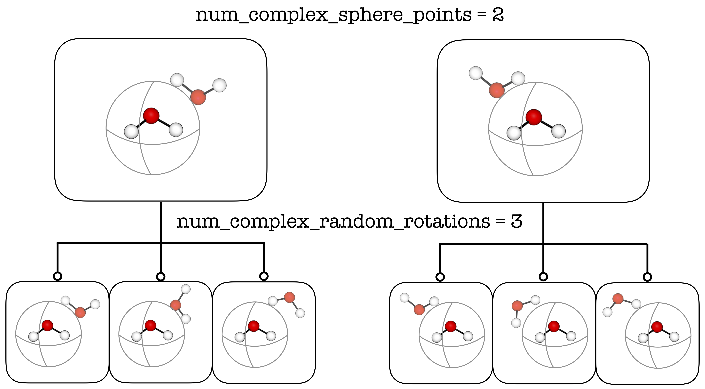
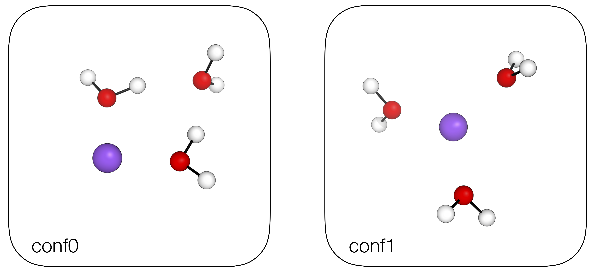

**********************************
Non-covalent Interaction Complexes
**********************************

**autodE** allows for the systematic search of a NCI complexes conformational
space. For example, to find the lowest energy structure of the water trimer:

.. literalinclude:: ../common/water_trimer.py

Out (visualised)

.. image:: ../common/water_trimer.png
   :width: 650

|

The parameters (:code:`num_complex_sphere_points` and :code:`num_complex_random_rotations`)
define the number of generated conformers, up to :code:`ade.Config.max_num_complex_conformers`.

|
|

By default, **autodE** will exclude any conformers with differing connectivity, thus
may not generate any conformers of e.g. a [M(H\ :sub:`2`\O)\ :sub:`m`\]\ :sub:`n+`\  system.
Complexes of systems with dative bonds can be generated by including
:code:`allow_connectivity_changes=True`. For example, with a
[Na(H\ :sub:`2`\O)\ :sub:`3`\]\ :sup:`+`\ system:

.. literalinclude:: ../common/na_h2o_3.py

Out (visualised)

