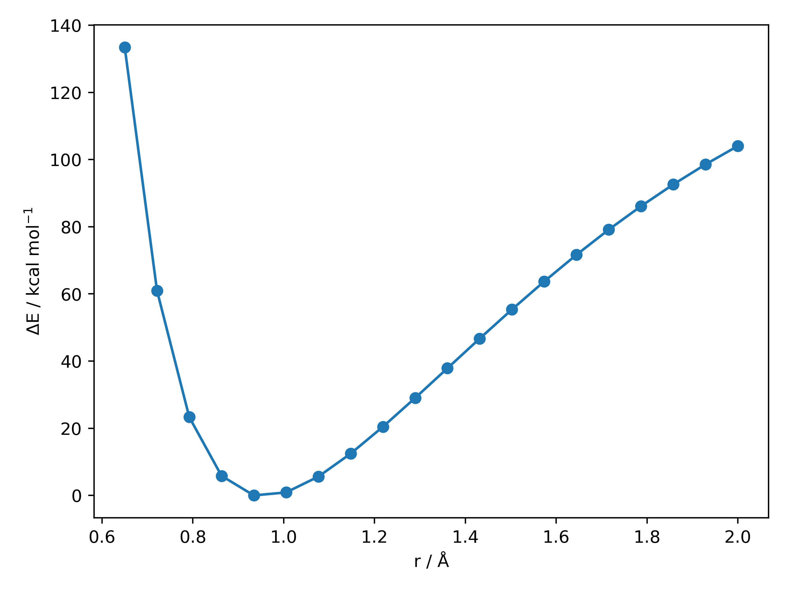

**************
PES Generation
**************

**autodE** allows for both potential energy surface (PES) to be constructed
where other degrees of freedom are frozen (unrelaxed) or allowed to
optimise (relaxed).

Unrelaxed
---------

For the O-H dissociation curve in H\ :sub:`2`\ O at the XTB level

.. literalinclude:: ../common/OH_PES_unrelaxed.py

Out (OH_PES_unrelaxed.png):

For the same O-H 1D PES scan using a selection of different DFT methods

.. literalinclude:: ../common/OH_PES_unrelaxed_DFT.py

Out (OH_PES_unrelaxed2.png):

.. image:: ../common/OH_PES_unrelaxed2.png

Relaxed
-------

**autodE** provides two ways of generating relaxed PESs the first in a similar
vain to the above is performing optimisations with distance constraints

.. literalinclude:: ../common/OH_PES_relaxed_manual.py

Out (OH_PES_comparison.png):

.. image:: ../common/OH_PES_comparison.png

Alternatively, a 1D PES can be generated using a :ref:`PES1d <pes1d>` object.

.. literalinclude:: ../common/OH_PES_relaxed.py

Out:

.. code-block::

    r (Å)  E (Ha)

    0.650 -4.8712
    0.721 -4.9765
    0.792 -5.0333
    0.863 -5.0606
    0.934 -5.0700
    1.005 -5.0690
    1.076 -5.0619
    1.147 -5.0514
    1.218 -5.0391
    1.289 -5.0257
    1.361 -5.0119
    1.432 -4.9980
    1.503 -4.9843
    1.574 -4.9710
    1.645 -4.9584
    1.716 -4.9464
    1.787 -4.9351
    1.858 -4.9246
    1.929 -4.9149
    2.000 -4.9060

