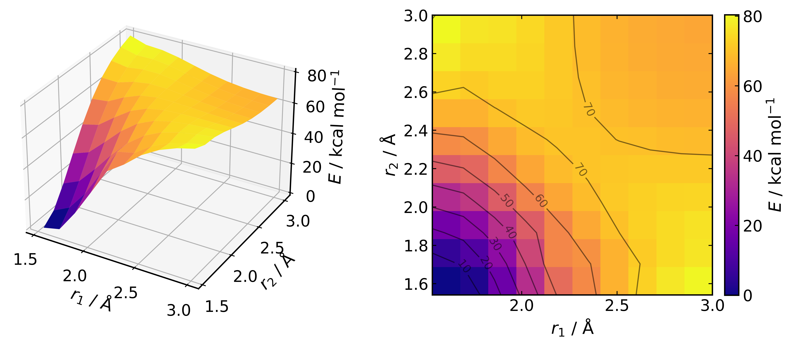
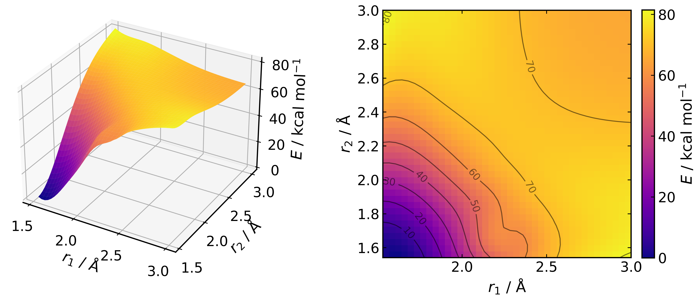

*****************
2D PES Generation
*****************

2D scans in **autodE** are available over distances and are optimally parallelised
over the available number of cores. For example, to calculate and plot the 2D
relaxed surface over the forming C-C distances in a Diels-Alder reaction between
ethene and butadiene:

.. literalinclude:: ../common/DA_2d.py

Out:

Surfaces can also be interpolated using a
`spline <https://docs.scipy.org/doc/scipy/reference/generated/scipy.interpolate.RectBivariateSpline.html>`_.
To reload the PES and plot using a 4-fold interpolation (i.e. 10 -> 40 points in each dimension):

.. literalinclude:: ../common/DA_2d_interp.py

Out:

where the .xyz file (cyclohexene.xyz) used is:

.. literalinclude:: ../common/cyclohexene.xyz

