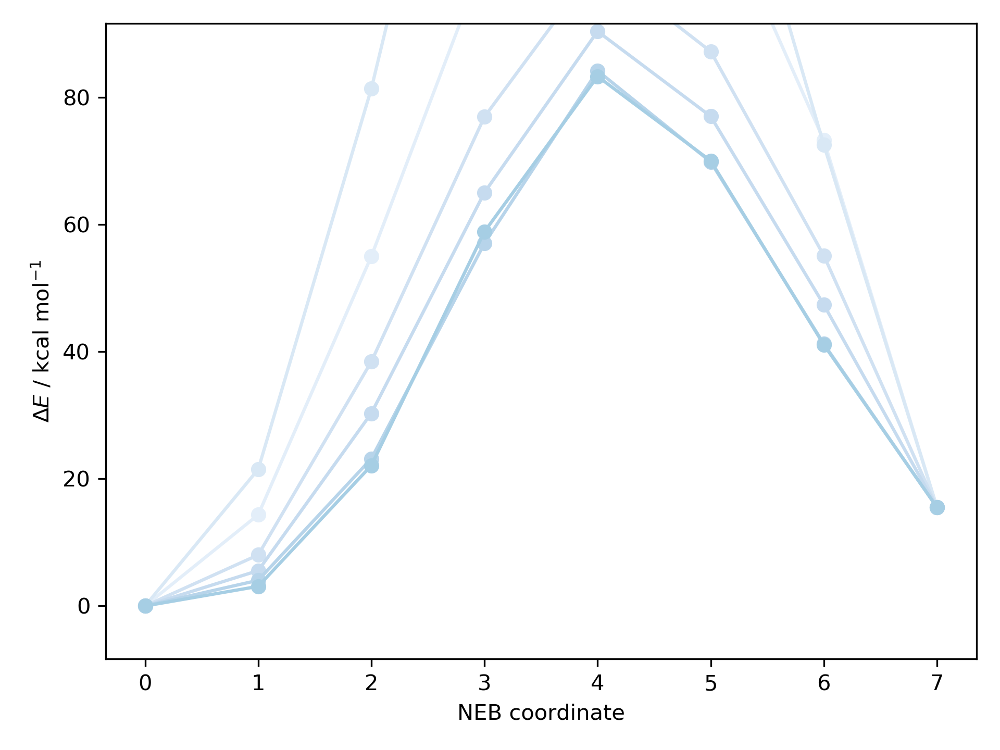
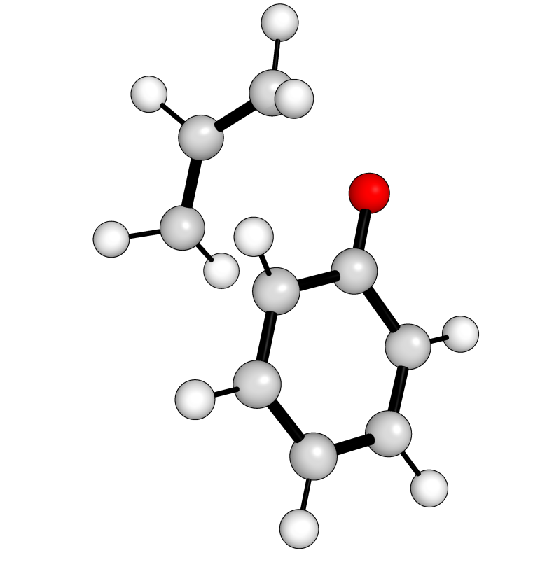

*****************
Transition States
*****************

Default
*******

In addition to generating full reaction profiles directly **autodE** provides
automated access to transition states. Given a specific bond rearrangement
generating a TS from known structures of reactants and products can be achieved
for a simple Cope rearrangement with

.. literalinclude:: ../common/cope.py

Out:

.. code-block:: python

  [-544.36]

where the xyz files used are:

.. literalinclude:: ../common/cope_r.xyz

.. literalinclude:: ../common/cope_p.xyz

CI-NEB
******

Minimum energy pathways can also be generated using nudged elastic band (NEB)
calculations. To find the peak species suitable as a TS guess geometry for
the prototypical Claisen rearrangement ([3,3]-sigmatropic rearrangement of
allyl phenyl ether)

.. literalinclude:: ../common/claisen_cineb.py

Out:

Out (visualised):

where the xyz files used are:

.. literalinclude:: ../common/claisen_r.xyz

.. literalinclude:: ../common/claisen_p.xyz
