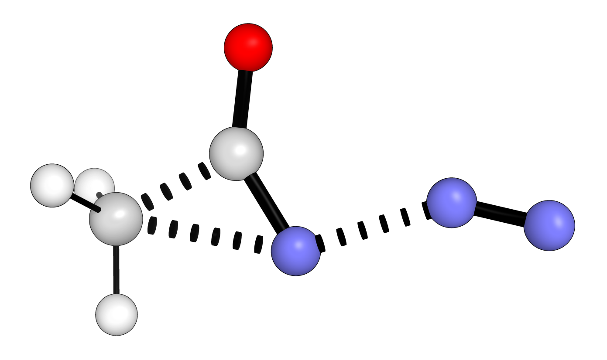

*****************
Transition States
*****************

In addition to generating full reaction profiles directly **autodE** provides
automated access to transition states (TSs). Either from a reaction, where bond rearrangements
are found and TS located along each possible path, or from 3D structures of reactants
and products, and a bond rearrangement given explicitly.

------------

Default: Reaction
*****************

For a simple Curtius rearrangement copied as a SMILES string directly from
Chemdraw\ :sup:`TM`\  (selecting reactants and products with arrows and '+' then Edit->Copy As->SMILES)
the TS can be located with

.. literalinclude:: ../common/curtius.py

Out (visualised)

.. note::
    :code:`locate_transition_state` only locates a single transtion state for
    each possible bond rearrangment and does not attempt to search the conformational
    space.

------------

Default: Reactants and products
*******************************

.. image:: ../common/cope.png

Given a specific bond rearrangement generating a TS from known structures of
reactants and products can be achieved for a simple Cope rearrangement with

.. literalinclude:: ../common/cope.py

Out:

.. code-block:: python

  [-544.36]

where the xyz files used are:

.. literalinclude:: ../common/cope_r.xyz

.. literalinclude:: ../common/cope_p.xyz

------------

CI-NEB
******

Minimum energy pathways can also be generated using nudged elastic band (NEB)
calculations. To find the peak species suitable as a TS guess geometry for
the prototypical Claisen rearrangement ([3,3]-sigmatropic rearrangement of
allyl phenyl ether)

.. literalinclude:: ../common/claisen_cineb.py

Out:

.. image:: ../common/claisen_neb_optimised.png

Out (visualised):

.. image:: ../common/claisen_peak.png
   :width: 300
   :align: center

where the xyz files used are:

.. literalinclude:: ../common/claisen_r.xyz

.. literalinclude:: ../common/claisen_p.xyz
