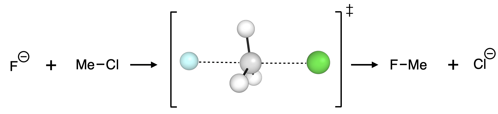
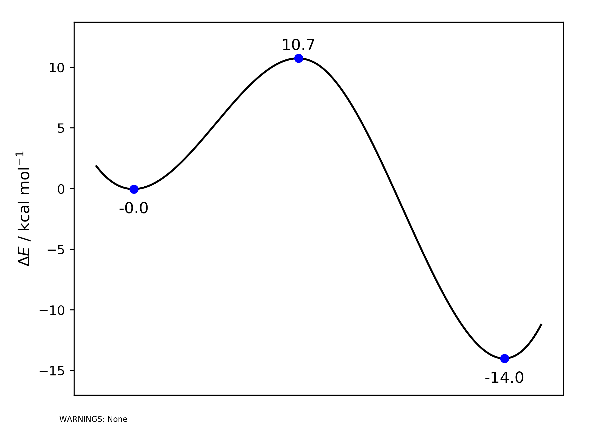

Quick Start
===========

Python scripts for these and other examples can be found
`here <https://github.com/duartegroup/autodE/tree/master/examples>`_.

------------

Diels Alder
------------

.. image:: common/diels_alder.png

For the simple [4+2] Diels-Alder reaction between ethene and butadiene the
reaction profile can be calculated in a couple of lines, where **autodE**
identifies reactants and products from the reaction `SMILES <https://en.wikipedia.org/wiki/Simplified_molecular-input_line-entry_system>`_
and executes using 8 CPU cores in 10 minutes or so using XTB and ORCA as the
low and high level methods respectively.

.. code-block:: python

    >>> import autode as ade
    >>> ade.Config.n_cores = 8

    >>> rxn = ade.Reaction('C=CC=C.C=C>>C1=CCCCC1', name='DA')
    >>> rxn.calculate_reaction_profile()

A directory (*DA/*) will be created where electronic structure calculations have
been performed and an image of the reaction profile saved in the current working directory. See below:

.. raw:: html

   <iframe width="700" height="394"
    src="https://www.youtube.com/embed/jWKbtR51zzc"
    title="YouTube video player" frameborder="0"
    allow="accelerometer; autoplay; clipboard-write; encrypted-media;
           gyroscope; picture-in-picture"
    allowfullscreen></iframe>

------------

S\ :sub:`N`\2
-------------

To generate a reaction profile for the S\ :sub:`N`\2 reaction between fluoride
and methyl chloride in water in more depth, we have the SMILES strings for the
reactant and products generated from Chemdraw (by selecting a
molecule → Edit → Copy As → SMILES):

.. note::
    **Fluoride**: [F-];  **MeCl**: CCl;  **Chloride**: [Cl-];  **MeF**: CF

Import **autodE** and set the number of processing cores that are available for
this calculation:

.. code-block:: python

  >>> import autode as ade
  >>> ade.Config.n_cores = 4

Initialise reactants and products from their respective SMILES strings giving
a name to each:

.. code-block:: python

    >>> Fluoride = ade.Reactant(name='F-', smiles='[F-]')
    >>> MeCl = ade.Reactant(name='CH3Cl', smiles='ClC')
    >>> Chloride = ade.Product(name='Cl-', smiles='[Cl-]')
    >>> MeF = ade.Product(name='CH3F', smiles='CF')

From reactants and products form a reaction in water and calculate the reaction profile:

.. code-block:: python

  >>> rxn = ade.Reaction(Fluoride, MeCl, Chloride, MeF, name='sn2', solvent_name='water')
  >>> rxn.calculate_reaction_profile()

This function call will generate a plot something like:

as *sn2_reaction_profile.png* in the current working directory, where conformers
of the reactant and products have been searched and the profile calculated at
PBE0-D3BJ/def2-TZVP//PBE0-D3BJ/def2-SVP using an implicit water solvent. It
should take around 10 minutes to complete.

.. note::
    **autodE** has default DFT methods set for optimisation and single point
    calculations. Therefore, by default, structures are optimised at
    PBE0-D3BJ/def2-SVP and single points calculations performed at
    PBE0-D3BJ/def2-TZVP. To use other methods see the
    :doc:`config page <config>`.
