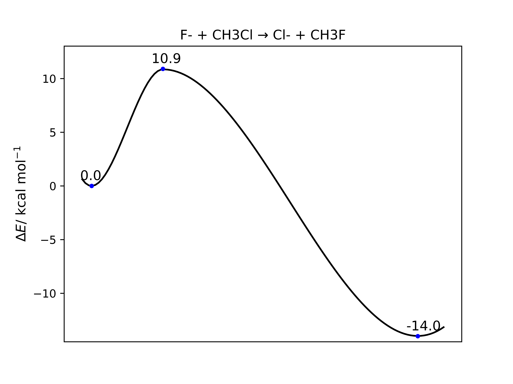

Tutorial
========

Python scripts for this and other examples can be found
`here <https://github.com/duartegroup/autodE/tree/master/examples>`_. They have
been tested using XTB & ORCA electronic structure theory packages.

S\ :sub:`N`\2 Reaction
----------------------

To calculate a reaction profile for the S\ :sub:`N`\2 reaction between F- and
methyl chloride in water we have the smiles strings for the reactant and
products generated from Chemdraw (by selecting a molecule → Edit → Copy As
→ SMILES):

.. note::
    Fluoride : [F-]

    MeCl     : CCl

    Chloride : [Cl-]

    MeF      : CF

Import the required objects and set the number of cores that are available for
this calculation

.. code-block:: python

  >>> from autode import Reactant, Product, Config, Reaction
  >>> Config.n_cores = 4

Initialise reactants and products from their respective SMILES strings giving
a name to each, which will be used in calculation file names

.. code-block:: python

    >>> Fluoride = Reactant(name='F-', smiles='[F-]')
    >>> MeCl = Reactant(name='CH3Cl', smiles='ClC')
    >>> Chloride = Product(name='Cl-', smiles='[Cl-]')
    >>> MeF = Product(name='CH3F', smiles='CF')

From reactants and products form a reaction in water and calculate the reaction profile.

.. code-block:: python

  >>> reaction = Reaction(Fluoride, MeCl, Chloride, MeF, name='sn2', solvent_name='water')
  >>> reaction.calculate_reaction_profile()

This function call will return a plot something like:

as *sn2_reaction_profile.png* in the current working directory, where conformers
of the reactant and products have been searched and the profile calculated at
PBE0-D3BJ/def2-TZVP//PBE0-D3BJ/def2-SVP using an implicit water solvent. It
should take around 10 minutes to complete on a modern processor.

.. note::
    **autodE** has default DFT methods set for optimisation and single point
    calculations. Therefore, by default structures are optimised at
    PBE0-D3BJ/def2-SVP and single points calculations performed at
    PBE0-D3BJ/def2-TZVP. To use other methods see the
    :doc:`config page <config>`.